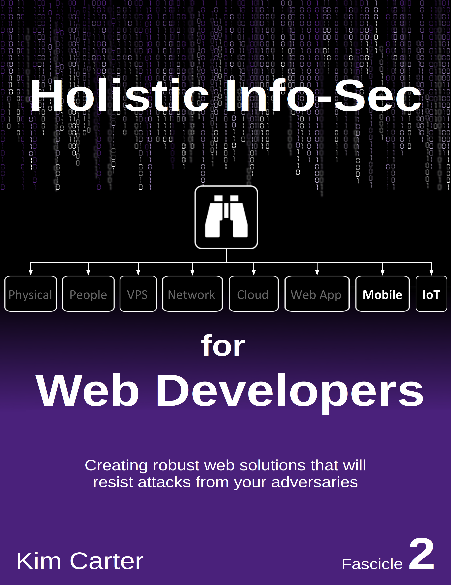

# Holistic InfoSec For Web Developers
## Fascicle 2
Mobile and IoT

To access the original (now out of date) training which the book was based on, head on over to the [wiki](https://github.com/binarymist/HolisticInfoSec-For-WebDevelopers/wiki/BinaryMist-Approach-To-Threat-Modelling) to get started.

The contents of fascicle 2 that's a WIP is listed below. The actual fascicle can be found [here](https://leanpub.com/holistic-infosec-for-web-developers-fascicle2-mobile-iot).

If there is something you would like to see included in this fascicle, please [submit an issue](https://github.com/binarymist/HolisticInfoSec-For-WebDevelopers-Fascicle2/issues) for consideration.

 

## Table of Contents

* Foreward (by ?)
* [Preface](manuscript/markdown/front/preface.md)
* [Introduction](manuscript/markdown/front/introduction.md)
* [Chapter 11: Mobile](manuscript/markdown/main/chapter11.md)
* [Chapter 12: IoT](manuscript/markdown/main/chapter12.md)
* [Additional Resources](manuscript/markdown/back/additional-resources.md)
* [Attributions](manuscript/markdown/back/attributions.md)
